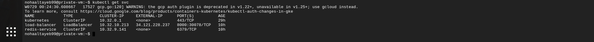
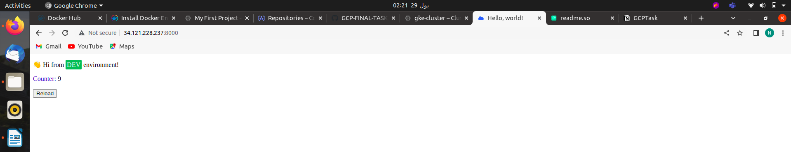

# GCPTask

## Requirements :

1 VPC
2 subnets (management subnet & restricted subnet):

1. Management subnet has the following:
• NAT gateway
• Private VM
2. Restricted subnet has the following:
• Private standard GKE cluster (private control plan)
Notes:
3. Restricted subnet must not have access to internet
4. All images deployed on GKE must come from GCR or Artifacts registry.
5. The VM must be private.
6. Deployment must be exposed to public internet with a public HTTP load balancer.
7. All infra is to be created on GCP using terraform.
8. Deployment on GKE can be done by terraform or manually by kubectl tool.
9. The code to be build/dockerized and pushed to GCR is on here:
[https://github.com/atefhares/DevOps-Challenge-Demo-Code](https://github.com/atefhares/DevOps-Challenge-Demo-Code)
10. Don’t use default compute service account while creating the gke cluster, create
custom SA and attach it to your nodes.
11. Only the management subnet can connect to the gke cluster.

## Creating Infrastructure Using Terraform

1-Network: one vpc with two subnets attached to two different ips

2-VM instance on the management subnetwork.

3-Setting up  gke  in private subnet.

4-A firewall rule attached to the private vm and allow ssh to it using IAP.

5-Nat gateway and a route table.

6-Service accounts that are attached to VM and GKE cluster.

```bash
terraform init
terraform apply 
```

## Containerizing  python application

I have created a one image for 2 containers  that connect a python app with redis database,
and then push it to GCR. 

```bash
docker build -t python-app .
docker run python-app.
```

## Configuring and installing kubectl inside VM using gcloud

```bash
noha@noha:~/Desktop/GCP-TASK$ gcloud compute ssh --zone "us-central1-a" "private-vm"  --tunnel-through-iap --project "my-project-noha"
noha@private-vm:~$ export CLOUD_SDK_REPO="cloud-sdk-$(lsb_release -c -s)"
noha@private-vm:~$ curl -O https://dl.google.com/dl/cloudsdk/channels/rapid/downloads/google-cloud-cli-394.0.0-linux-x86_64.tar.gz
noha@private-vm:~$ tar -xf google-cloud-cli-394.0.0-linux-x86_64.tar.gz
noha@private-vm:~$ ./google-cloud-sdk/bin/gcloud init
noha@private-vm:~$ gcloud components update
noha@private-vm:~$ echo "deb [signed-by=/usr/share/keyrings/cloud.google.gpg] https://packages.cloud.google.com/apt cloud-sdk main" | sudo tee -a /etc/apt/sources.list.d/google-cloud-sdk.list
noha@private-vm:~$ curl https://packages.cloud.google.com/apt/doc/apt-key.gpg | sudo apt-key --keyring /usr/share/keyrings/cloud.google.gpg add -
noha@private-vm:~$ sudo apt-get update
noha@private-vm:~$ sudo apt-get install google-cloud-sdk-gke-gcloud-auth-plugin
noha@private-vm:~$ sudo apt-get install kubectl
```

## Creating all YAML deployment files

```bash
kubectl -f create redis_deployment.yml
kubectl -f create service.yml
kubectl -f create loadbalancer.yml
kubectl -f create app_deployment.yml
kubectl get svc
```



## And here is the app 🥳

